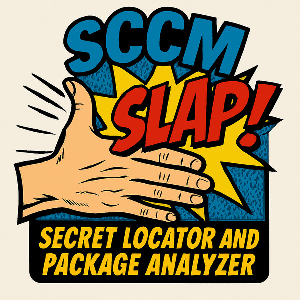
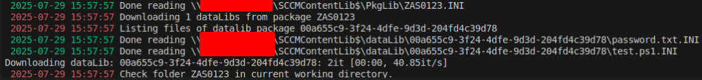

# SLAP (Secret Locator and Package Analyzer)

Inspired by the great tool [CMLoot](https://github.com/1njected/CMLoot) by 1njected/Tomas Rzepka

SCCM deployment points contain a share which is readable by default by any AD user. This SCCMContentLib$ share in contains applications, packages, and updates, making it a potential treasure trove for uncovering sensitive information.

With SLAP you don't have to go through every file to search for secrets. Furthermore, you can download entire packages with a working filestructure. This allows you to e.g. install software that is normally distributed through SCCM or decrypt secrets/configs because the key is in another file of the same package.

It includes the following features:
- Search and report (json format) secrets in files based on regular expressions defined in the config file
  - Report contains packageID, filename, path in fileLib, filesize, time of last modification, matched content and a expanded match of a few more lines before and after the match
- Report a file based on its filename only
- save filehashes that did not have a secret. (E.g. to ignore in future scans)
- create a basic csv inventory file to grep through (or excel)
- Limit the scan to specific packageID's
- bypass secured datalibs ([package access accounts](https://learn.microsoft.com/en-us/intune/configmgr/core/plan-design/hierarchy/accounts#package-access-account)) by searching through the fileLib for references of said datalibs
- Download entire packages for further analysis



## OPSEC
**The tool is pretty noisy. Every worker opens a seperate SMB connection.**

## SCCM Deployment Point - File Structure
SCCMContentLib$ shares contain 3 folders: PkgLib, DataLib and FileLib. PkgLib contains a reference to the DataLibs included in a package. DataLib contains the directories, filestructure/filenames and some meta data (last modified date, size of a file, filehash) while fileLib contains the actual files. The filenames in fileLib are the hashes of the file content itself. [More info](https://learn.microsoft.com/en-us/intune/configmgr/core/plan-design/hierarchy/the-content-library) 


## Requirements
```
pip3 install tqdm memoization chardet colorlog PyYAML impacket
```

## How to find relevant hosts?
A host is scannable if it has the SCCMContentLib$ share. You can also use one of the recon techniques of [Misconfiguration Manager](https://github.com/subat0mik/Misconfiguration-Manager/tree/main) to identify hosts in the network.

If you are already on a host that should be managed through SCCM you can use:
```powershell
(Get-ItemProperty -Path HKLM:\SOFTWARE\Microsoft\SMS\DP -Name ManagementPoints).ManagementPoints
```
Or look for fqdns in C:\Windows\CCM\Logs\LocationServices.log

## Help
```
SCCM SLAP (SCCM Secret Locator and Package Analyzer)

positional arguments:
  target                [[domain/]username[:password]@]<targetName or address>

options:
  -h, --help            show this help message and exit
  -config CONFIG        Config as YAML file
  -outputfile OUTPUTFILE
                        Output file to log smbclient actions in
  -v                    Turn verbose output ON level 1. (PkgLib Level)
  -vv                   Turn verbose output ON level 2. (DataLib Level)
  -vvv                  Turn verbose output ON level 3. (FileLib Level)
  -debug                Turn DEBUG on to analyze cache and memory usage.
  -limit LIMIT          Only parse x amount of packages
  -download DOWNLOAD    Download all files of packageID into current working directory
  -packages PACKAGES    Comma seperated string of packages that should be scanned e.g. ZAS03801,ZAS04845
  -filesize             Testing: Just skip large files. No extension whitelisting.
  -saveHashes           Adds hashes with no findings to a file in current working directory.
  -inventory            Creates inventory csv in current working directory. If set, no patterns are checked. (PackageID;dataLib_FileName;timemodified;filesize_KB;fileLib_path)
  -workers WORKERS      Number of workers for parallel tasks
  -unsecureDatalibs     reads denied_datalibs_<address>.txt and checks patterns of config in fileLib-files with reference to secured datalibs.

impacket:
  -hashes LMHASH:NTHASH
                        NTLM hashes, format is LMHASH:NTHASH
  -dc-ip ip address     IP Address of the domain controller. If omitted it will use the domain part (FQDN) specified in the target parameter
  -target-ip ip address
                        IP Address of the target machine. If omitted it will use whatever was specified as target. This is useful when target is the NetBIOS name and you cannot resolve it
```

## Examples
### Scan SCCMContentLib$
``` python
./SLAP.py user:pass@FQDN -config config.yml -outputfile out.json
```
### Download a package
``` python
./SLAP.py user:pass@FQDN -download ZAS123456
```
### Scan only certain packages
``` python
./SLAP.py user:pass@FQDN -packages ZAS123456,ZAS654321
```
### Create a inventory file to e.g. grep and look for filenames
``` python
./SLAP.py user:pass@FQDN -inventory
```
### Scan secured dataLibs (package access accounts)
``` python
# scan the share first so the denied_datalibs file is created
./SLAP.py user:pass@FQDN -config config.yml -outputfile out.json 
# scan with -unsecureDatalibs to only scan files that reference denied_datalibs
./SLAP.py user:pass@FQDN -unsecureDatalibs
```
### scan using hash
``` python
./SLAP.py user@FQDN -config config.yml -outputfile out.json -hashes LMHASH:NTHASH
```